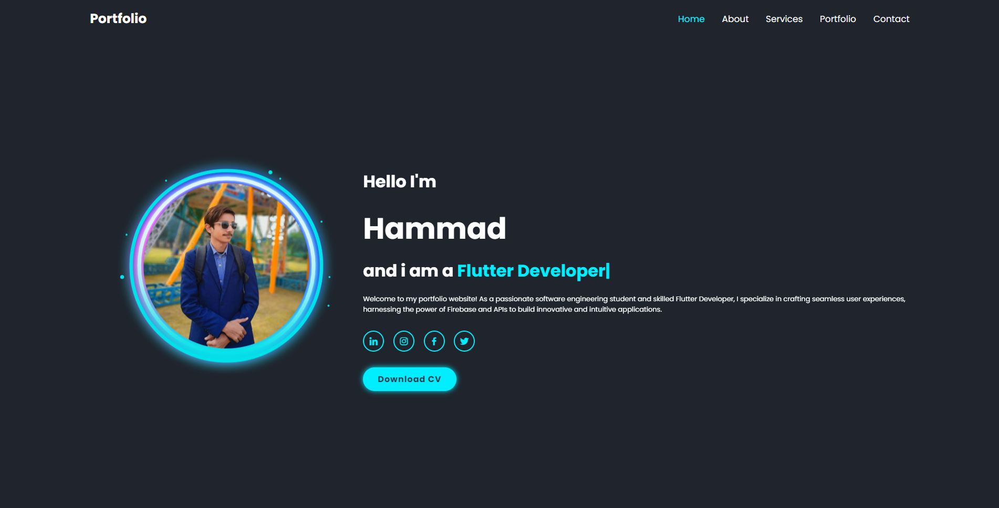
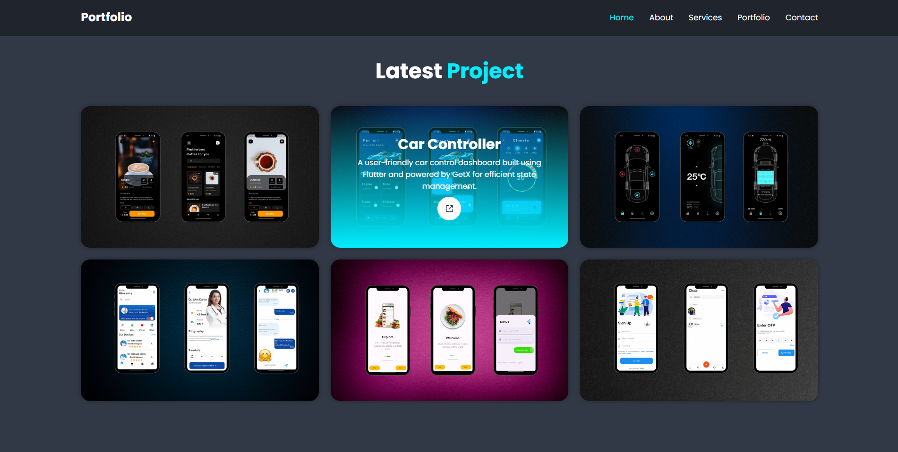

# Personal Portfolio Website

Welcome to my personal portfolio website! This repository contains the code and assets for my online portfolio where you can learn more about me, my skills, view my projects, and get in touch with me. This README file provides an overview of the website and instructions on how to set it up locally or deploy it.

## Introduction
As a Flutter Developer, I wanted to have a professional online presence to showcase my skills, projects, and contact information. This website serves as a centralized platform where visitors can learn more about me, view my work, and connect with me for potential collaboration or job opportunities.

## Features
1. **About Me**: This section provides a brief introduction to who I am, my background, and my passion for Flutter Development.
2. **My Projects**: This section displays a collection of my completed projects, along with descriptions, links, and any relevant technologies used.
3. **My Skills**: Here, you can find an overview of my technical skills and areas of expertise, along with proficiency levels.
4. **Contact**: This section offers various ways for visitors to get in touch with me, such as through email, social media links, or a contact form.
5. **Responsive Design**: The website is designed to be responsive and accessible on various devices, ensuring a seamless user experience.

## Screenshot

 

## Getting Started
To run the portfolio website locally, follow these steps:

1. Clone the repository:

2. Navigate to the project directory:

3. Open the `index.html` file in your preferred web browser.

## Technologies Used
- HTML
- CSS
- JavaScript

## How to Use
The website is designed to be intuitive and user-friendly. Here's a quick guide on how to navigate and use the website:

1. **Home**: The landing page welcomes you with a brief introduction and a call-to-action to explore the rest of the website.
2. **About Me**: Click on the "About Me" section in the navigation bar to read more about my background and interests.
3. **My Projects**: Navigate to the "My Projects" section to view a list of my completed projects. Click on a project to learn more about it.
4. **My Skills**: Visit the "My Skills" section to see an overview of my technical skills and expertise.
5. **Contact**: In the "Contact" section, you'll find different options to get in touch with me.

Feel free to explore and interact with the different sections to learn more about me and my work!

## Contributing
I welcome contributions and feedback from the community. If you find any issues with the website or have suggestions for improvements, please open an issue or submit a pull request. I'll be happy to review and merge valid contributions.

## Contact
If you have any questions or just want to say hello, you can reach me at rh676838@gmail.com. Additionally, you can connect with me on [LinkedIn] https://www.linkedin.com/in/hamad-anwar

Thank you for visiting my portfolio website! I hope you enjoy exploring it as much as I enjoyed creating it.
